FastColonyCounting 
==================

A simple Software running on Matlab 7.0 GUI environment to automatic count  colony number in Image. Use Matlab library and algorithm to realize almost all the function of this software. Only one image can be deal onece now. 
一个在Matlab 7.0 下编写的GUI应用软件，用来自动统计图片中的菌落个数。几乎所有功能实现都是基于Matlab本身的库。目前只支持一次处理一张图片。

项目说明
------------------
测试图片在[fastcolonycounting/fig0.jpg](fastcolonycounting/fig0.jpg)  
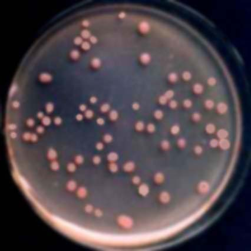  

项目截图
------------------
* 项目主页 
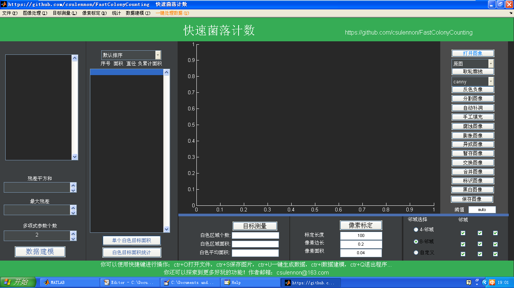 
* 打开待处理的图片 
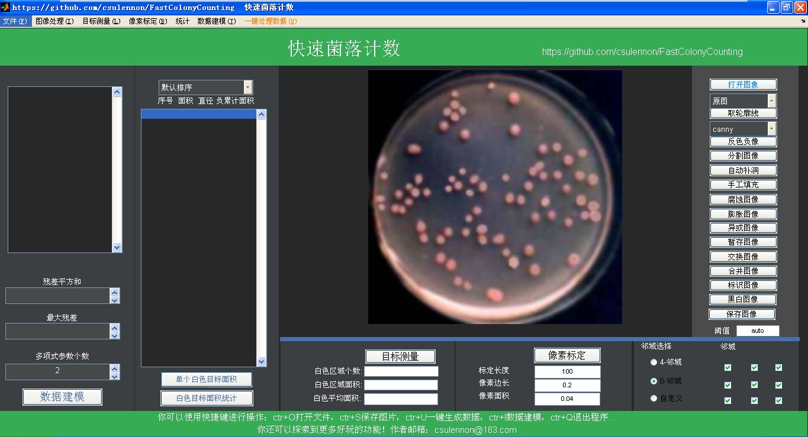  

* 边缘检测 
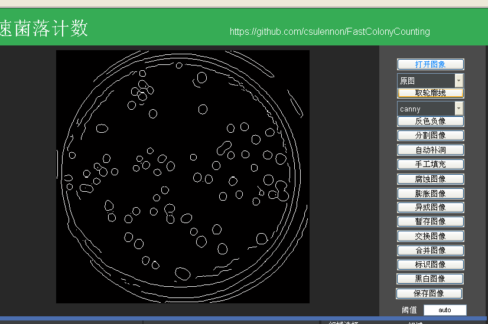  
* 自动补洞 
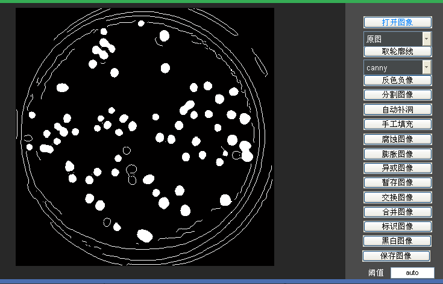  
* 腐蚀图像 
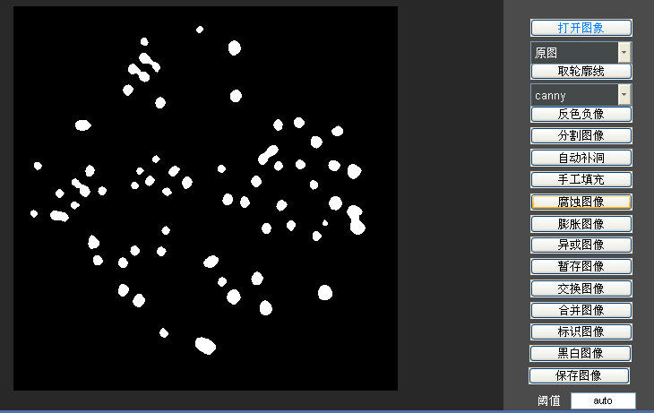  
* 膨胀图像 
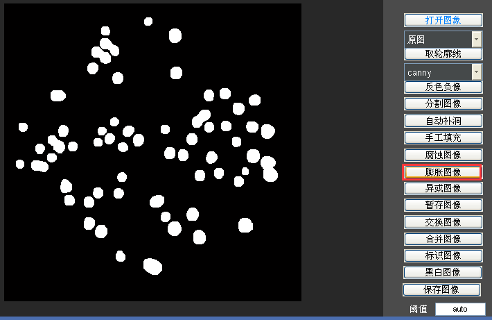  
* 分割图像 
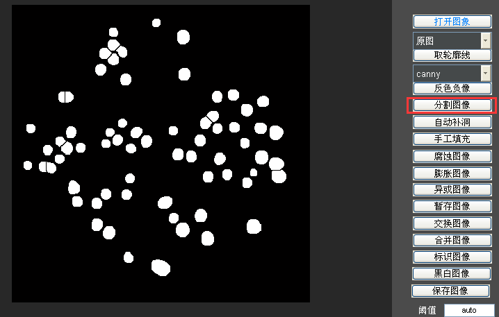  
*保存图像 
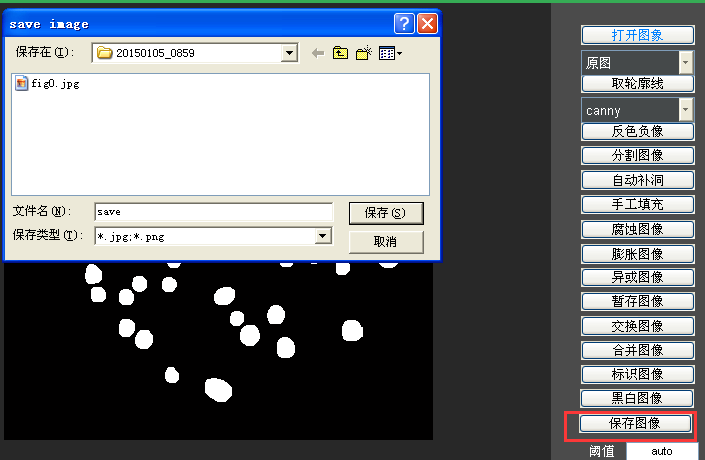  
* 一键处理数据 

> 注意  
> 需要首先打开图像才能进行处理！ 

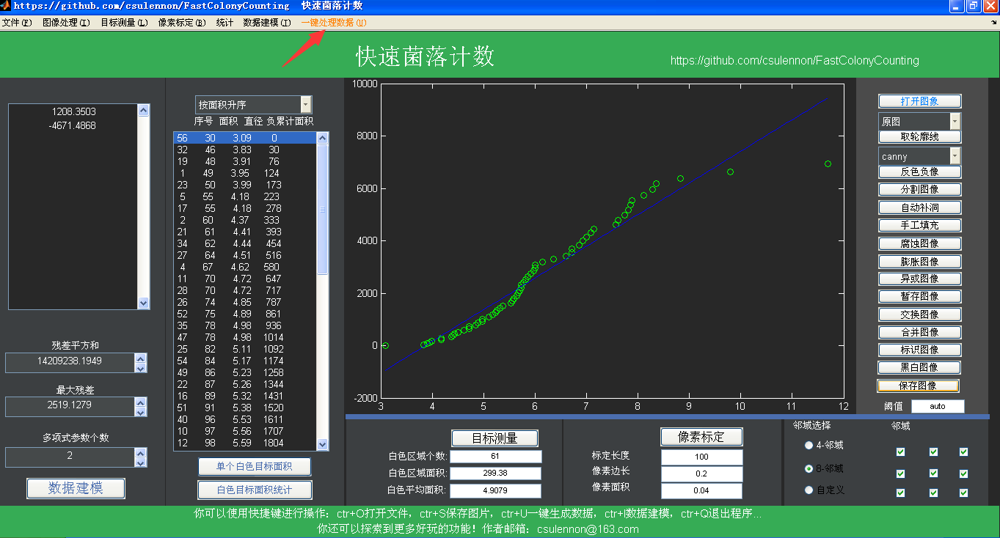  
* 手动选择菌斑进行处理  

> 处理方法为：  
> 鼠标左键选择需要统计的菌斑，可以多选。  
> 双击鼠标则选择结束。  
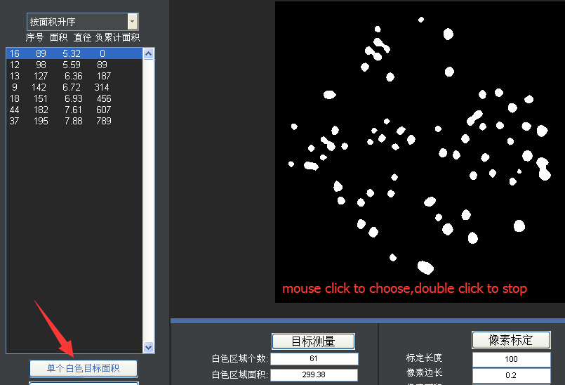  

License
-------
 Copyright 2015 csulennon

    Licensed under the Apache License, Version 2.0 (the "License");
    you may not use this file except in compliance with the License.
    You may obtain a copy of the License at

        http://www.apache.org/licenses/LICENSE-2.0

    Unless required by applicable law or agreed to in writing, software
    distributed under the License is distributed on an "AS IS" BASIS,
    WITHOUT WARRANTIES OR CONDITIONS OF ANY KIND, either express or implied.
    See the License for the specific language governing permissions and
    limitations under the License.
